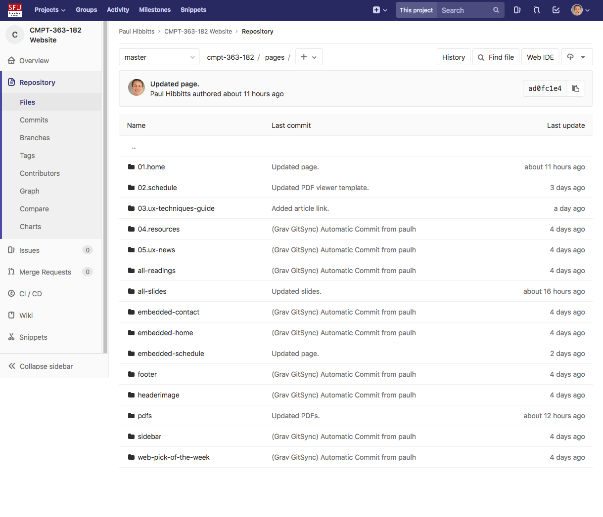
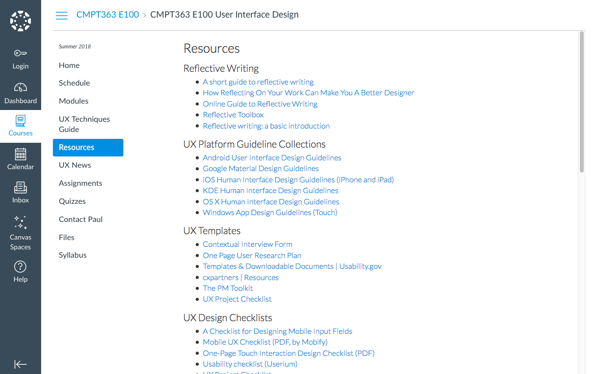
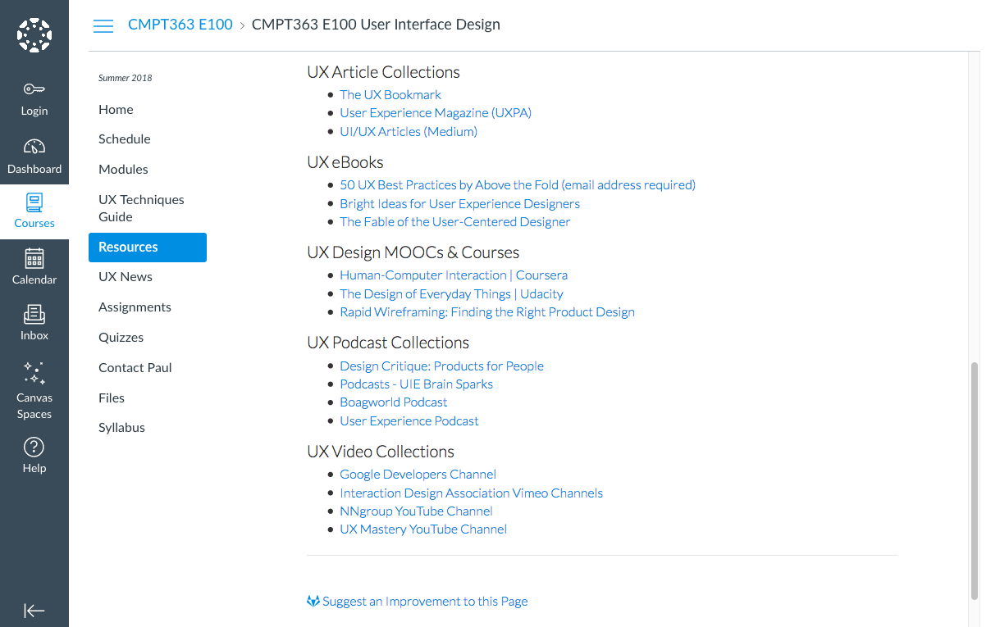
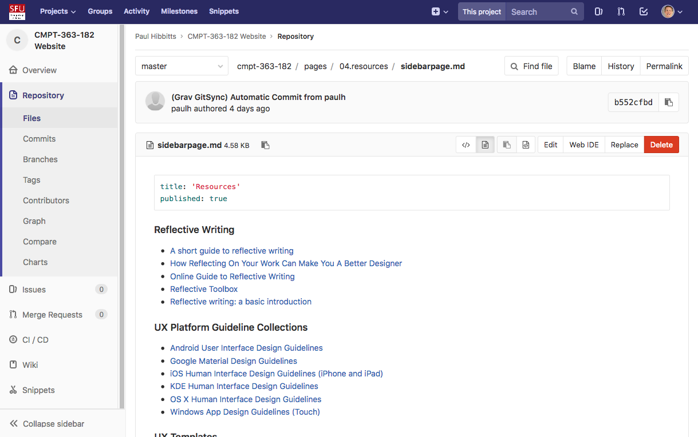
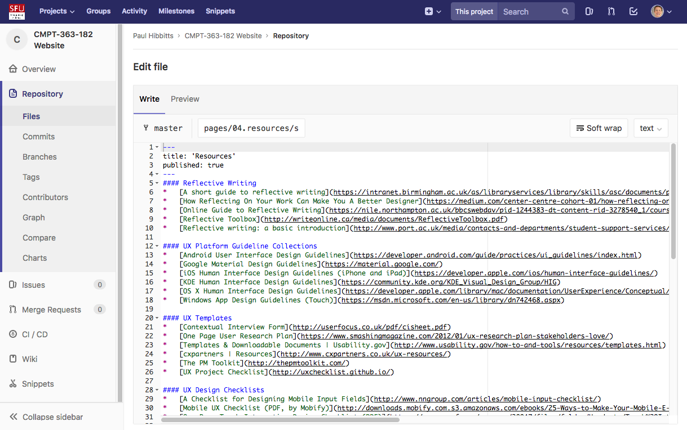
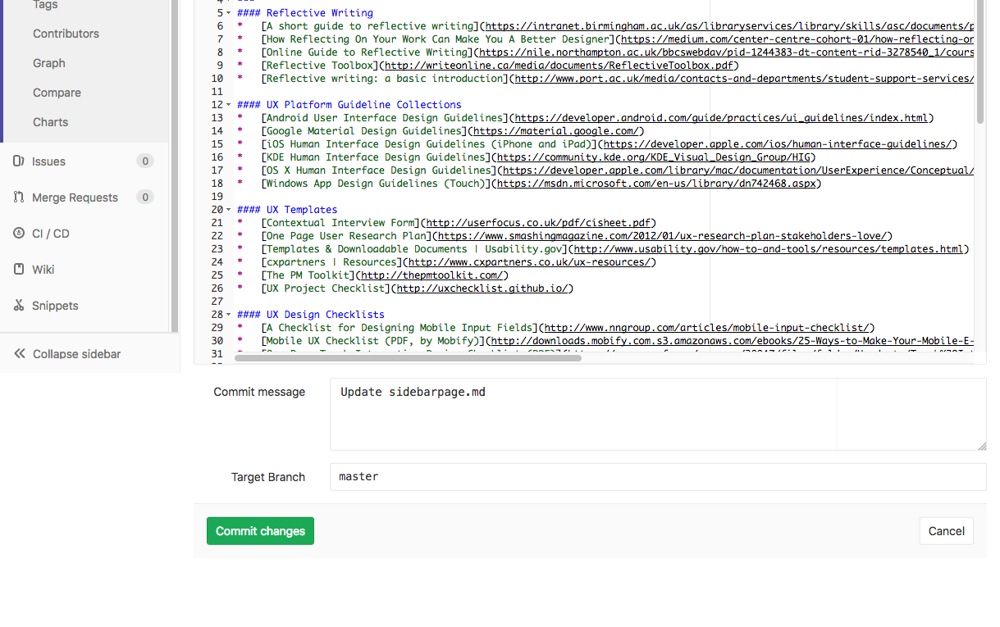
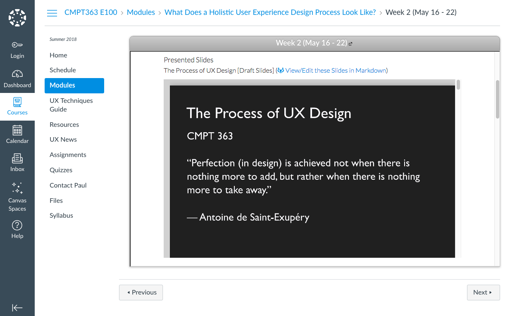
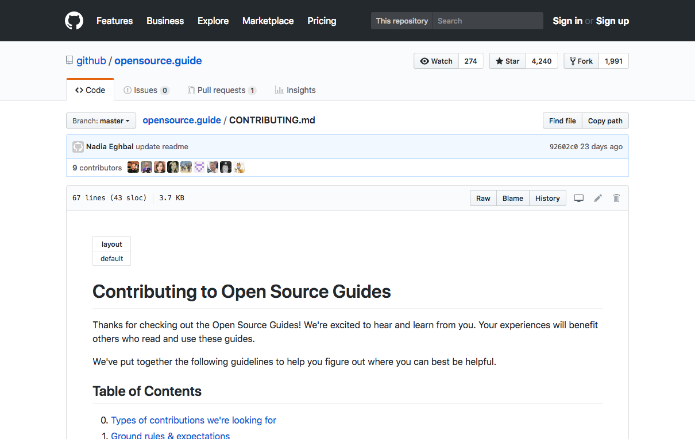
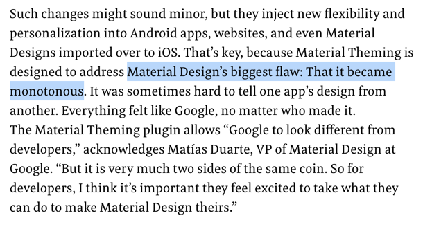

[.header: alignment(center)]  
[.text: alignment(center)]  

# Course Overview

### CMPT 363

> When software is hard to use, don’t make excuses for it. Improve it. When a user makes a mistake, don’t blame the user. Ask how the software misled them. Then fix it. The user’s time is more valuable than ours. Respect it. Good UI design is humble.
-- Jono DiCarlo

---

[youtube]https://www.youtube.com/watch?v=QM_vAD6jetg[/youtube]

---

# Instructor

Paul Hibbitts  
Email: <paulh@sfu.ca>  
Twitter: [@hibbittsdesign](https://twitter.com/hibbittsdesign)  
Office hours: TBD

---

# About Me

* Educator, Interaction Designer, and Open Source Author
* (Recovering) User Experience Consultant,
established Hibbitts Design in 1998
* Current focus is creating open source software for the field of education
* 125+ successful software UX projects, with 40+ clients such as SAP BusinessObjects, The Canadian Real Estate Association and The University of British Columbia
* Usability Mentor, 2009 Season of Usability
(co-sponsored by Google)
* Human Factors International (HFI) Certified Usability Analyst
* Instructor at Simon Fraser University, since 1997

---

[.background-color: #FFFFFF]


---


---

[.background-color: #FFFFFF]


---

# Teaching Assistant

TBD

---

[.background-color: #2d6e92]
[.header: alignment(center),#FFFFFF]

# _Ok, so what do you want to learn in this class?_

---

# Course Objectives

* Describe and apply key UI/UX concepts, techniques,
and principles
* Assess and describe the usability and UX of a digital interface
* Plan, conduct, and analyze user research for a digital product
* Conceptualize, design, and prototype a digital product
* Plan, conduct, and analyze a usability test of a digital product
* Participate and contribute as a member of a team
* Care about how people feel about and experience technology

---

# Course Objectives One-liner
<br>

---

# Course Objectives One-liner

### “Problem-solving​”
<br>

---

# Course Objectives One-liner

### “~~Problem-solving~~”
<br>

---

# Course Objectives One-liner

### “________ problem-solving”
<br>

---

# Course Objectives One-liner

### “Empathetic problem-solving”
<br>

---

# Course Objectives One-liner

### “Empathetic problem-solving ____________________”
<br>

---

# Course Objectives One-liner

### “Empathetic problem-solving aligning people, business and technology.”
<br>

---

# [fa=fa-exclamation-triangle] Reasons To Avoid This Course [fa=fa-exclamation-triangle]

* Weekly readings, along with a quiz, are required
* Frequent in-class individual and group exercises
* Group assignment(s) are mandatory
* Assignments will require a substantial amount of effort
* Satisfactory peer reviews will be a requirement to receive grades for certain assignments
* Good communication _and_ writing skills are critical  
* It is a design course, where assessments will often be determined on subjective opinion (primarily mine)
* I expect your designs to be more than just usable (also useful and desirable)
* Instructor design review and critique session
* Getting A’s in other computer science courses has little relevance in this course

---

# Reasons Why You Might Want To Stick Around

* A ~~good~~ great UX is now a software industry expectation
* Poorly designed interfaces cost money, require additional support, and waste people’s valuable time
* A basic understanding of user experience design processes and techniques will be helpful when working in the software industry
* You will experience how to work on design challenges
within teams
* The user-centered design process and techniques that you will learn can be applied to many other domains
* You have the opportunity to learn from an experienced industry practitioner and educator ([ca.linkedin.com/in/paulhibbitts/](http://ca.linkedin.com/in/paulhibbitts/))

---

# Course Outline as Topics

* Design Research
* User-Centered Design
* Interaction Design
* Multi-platform Design
* Usability Evaluation

---

# ~~Course Outline as Topics~~

* Design Research
* User-Centered Design
* Interaction Design
* Multi-platform Design
* Usability Evaluation

---

# Course Outline as Questions

* What is usability and user experience design?
* What does a holistic user experience design process look like?
* How to understand and communicate people’s needs and behaviors?
* How to explore and communicate possible design solutions?
* How to make more strategic design decisions?
* How to bridge the gap between the problem space and design space?
* What are the essentials of effective visual communication?
* How to design for mobile and multi-device usage?
* How to conduct a usability inspection?
* How to plan, conduct, and summarize usability tests?

---

# Laptop Policy - Let’s Discuss!

As both an instructor and audience member, I have found the increasing use of laptops to be a major distraction, not only for the people actually using laptops but also for those sitting around them

---

# One Minute Wrap-up Summary (A.K.A. Bonus Points Opportunity)

Immediately after (up until 12 midnight the day of class) you will be asked to write down and answer via the  [Canvas Class Discussion Board](https://canvas.sfu.ca/courses/38847/discussion_topics) the most valuable thing you learned, and any questions that you may still have.

---

# Required Textbook

---

# Required Textbook

Are you kidding me, in 2019? All required readings will be available on-line.

---

# Midterms and Final Exams

---

# Midterms and Final Exams

None — midterms and finals are most often poor gauges of what students have really learned.

---

# Canvas Course Site

[paulhibbitts.net/cmpt-363](http://paulhibbitts.net/cmpt-363) ([bit.ly/cmpt-363](http://bit.ly/cmpt-363))

I always want to hear from you how together we make our Canvas course hub better. Be honest, I can take it.

---

# Quick Poll

❑ HTML  
❑ Markdown  
❑ CSS  
❑ Twig  
❑ YAML  
❑ PHP  
❑ GitHub/GitLab

---



---



---



---



---



---



---



---


---

# Course Grading (tentative)

- Individual (50%)
 - Weekly Reading Quizzes: 5%
 - Journey Map: 15%
 - Usability Inspection (including possible peer reviews): 25%
 - Reflection Log: 5%
- Group (25%)
 - User Research Report: 25%
- Team or Group (25%)
 - Usability Tested Mockups: 25%

---

# Weekly Reading Summaries

- Summarize (in one complete sentence each) how you found
the reading:
 - Surprising?
 - Puzzling?
 - Useful?
 - New?
 - Know already?
 - Interesting?
- Each submitted reading summary will be assessed as either satisfactory (a.k.a. full marks) or unsatisfactory (a.k.a. zero)
- When assigned, reading summaries must be submitted no later than 10:00am class day - no exceptions... ever... so don’t ask

---

# Weekly Reading Summaries

A practice reading quiz (not graded) will be available tomorrow on the course hub, due by 10:00am May 16th

---

# Individual and Group Assignments

### Two Options:

* Student group choice of open source app
* SFU’s Coursys app ([github.com/sfu-fas/coursys](https://github.com/sfu-fas/coursys))

---

# Assignment Policy

- Any assignment submitted may be shared/shown in class and also publicly
(with all student or group identity information removed if public)
- Late assignments will not be accepted without valid documentation (e.g. medical certificate)
- Each group assignment group member may be subject to a participation assessment by all their group peers
- At my discretion, the grades of group members who are clearly not contributing a fair share of work may be adjusted​, including​ a grade of zero (0)

---

# Important Dates (Tentative)

- Individual Reflection Log  
  - Assigned May 16th, due Aug 3rd
- Individual Journey Map  
  - Assigned May 23rd, due Jun 5th  
- Individual UI Inspection  
  - Assigned Jun 6th, due Jun 19th  
- Group Assignment: User Research Report  
  - Assigned Jun 27th, due Jul 17th (Draft user research plan due Jul 2nd)  
- Team or Group Assignment: Usability Tested Mockups  
  - Assigned Jul 18th, due Aug 1st (Draft designs due Jul 23rd)

---

# Some Items of Recent Interest...

- Taking Open Source UX to the Next Level
- Google Material Theming
- Design Ethics

---

[.background-color: #FFFFFF]
[.text: #FFFFFF, alignment(center)]


###### [https://opensource.guide](https://opensource.guide)

---

[.text: #FFFFFF, alignment(center)]

  

###### [https://github.com/github/opensource.guide](https://github.com/github/opensource.guide)

---


---

[.background-color: #FFFFFF]

  

---

[.background-color: #FFFFFF]
[.text: #FFFFFF, alignment(center)]

  

---

[.background-color: #FFFFFF]
[.text: #FFFFFF, alignment(center)]

  

---

# Thank you!

### Questions or Comments?

---

[.background-color: #888888]
[.header: #FFFFFF, alignment(left)]

# Image Credits

```
https://blog.fastmonkeys.com/2014/06/18/minimum-viable-product-your-ultimate-guide-to-mvp-great-examples/`
https://twitter.com/jopas/status/515301088660959233?lang=en
https://design.google/news/
https://www.fastcodesign.com/90171179/exclusive-meet-material-theming-googles-ambitious-design-tool
```
