[.header: alignment(center)]
[.text: alignment(center)]

# Conceptual Models and Design

### CMPT 363

> “You only use what you understand.”  
– Steve Jobs

---

[.background-color: #618B25]

# _How to bridge the gap between the problem space and design space?_

---

[.background-color: #FFFFFF]


---

[.background-color: #618B25]
[.header: alignment(left),#FFFFFF]


# Topics to Explore
1. Conceptual Models  
2. Designing for Emotion  
3. Accessible and Inclusive Design

---

[.background-color: #611036]
[.header: alignment(left),#FFFFFF]

# Conceptual Models and Design

### Conceptual Models

---

# Activity: Interaction Design Case Study

Apple iOS

---

# Apple iOS 6

---

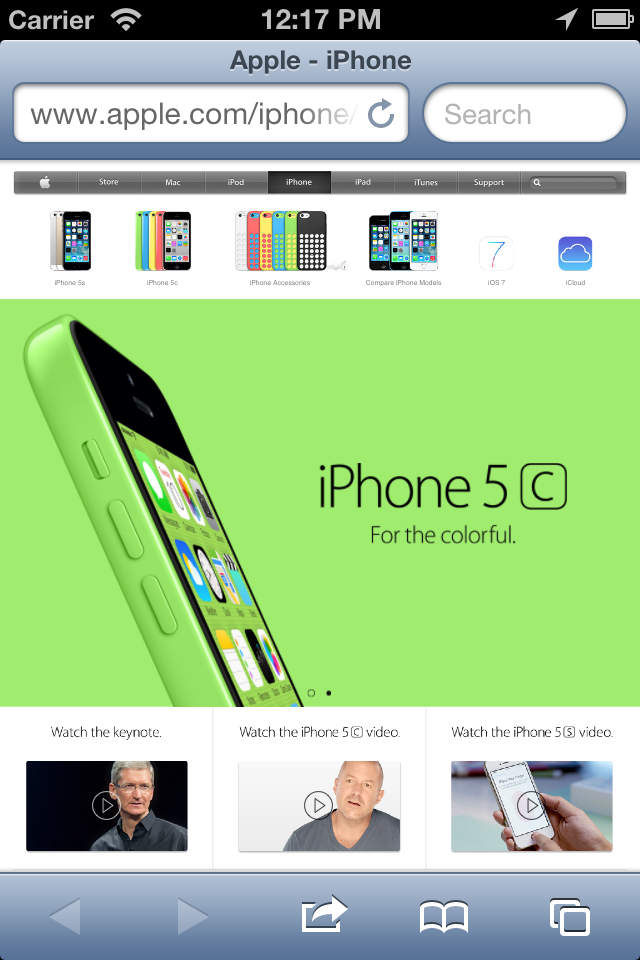

---

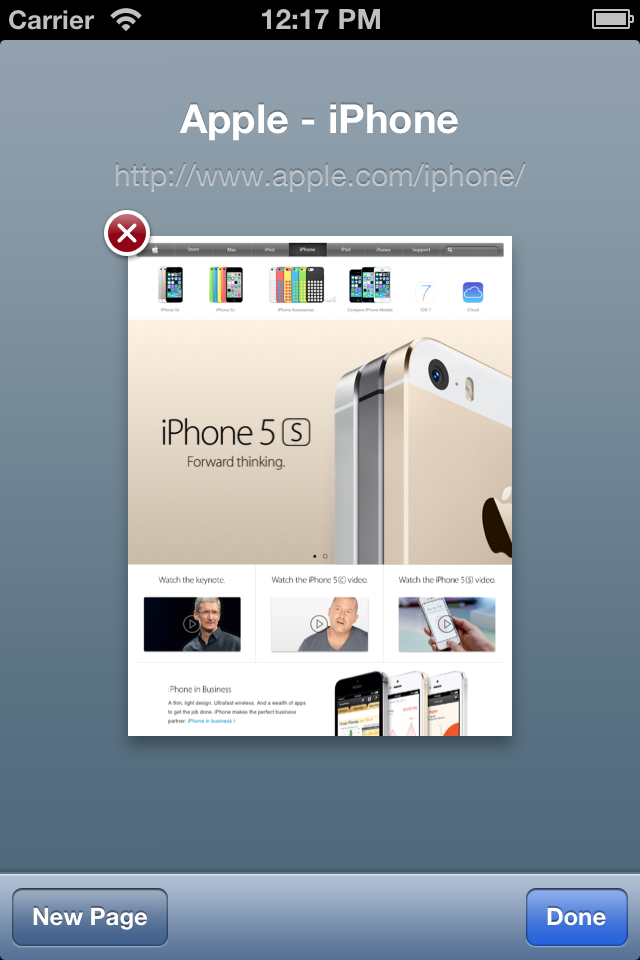

---


---

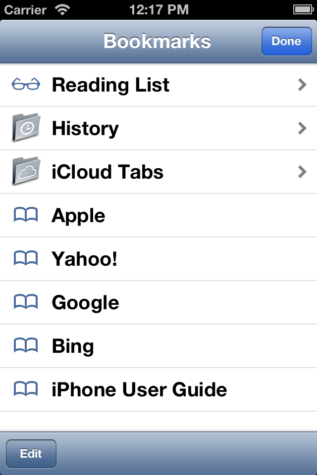

---


---


---

# Apple iOS 7
(and iOS 8, iOS9, iOS10 and yes iOS11)

---

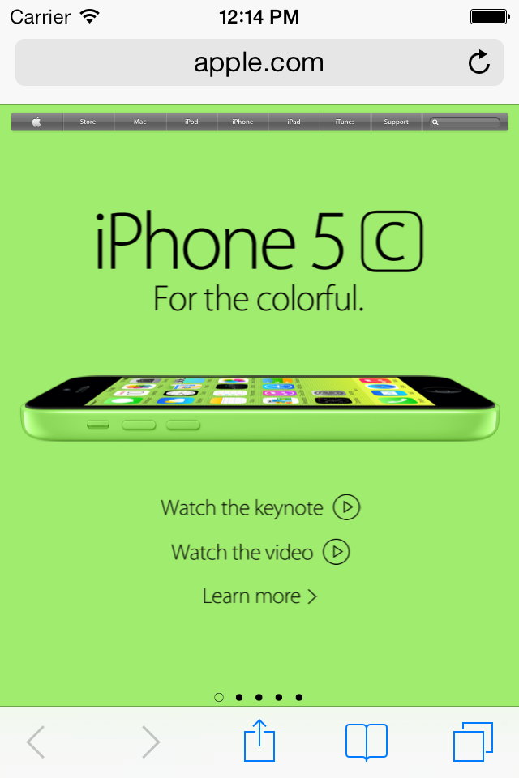

---

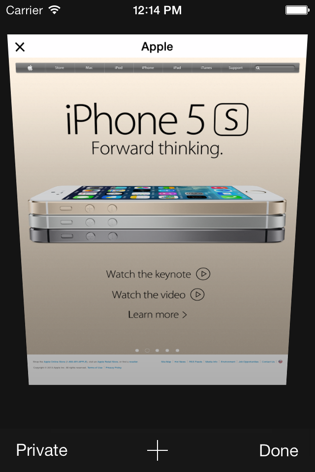

---


---


---

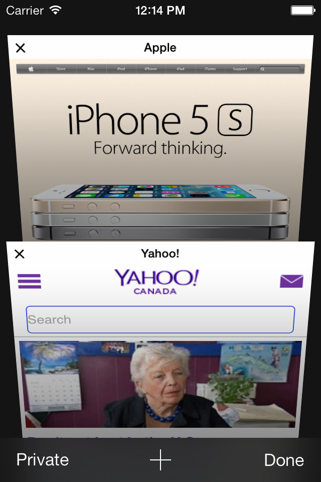

---

# _Now, let’s get into the details of… Conceptual Models_

---

# Mental Model

A mental model is the mental representation of how a system (object) operates

---

# Mental Model

A mental model is also sometimes called the user’s conceptual model

---

[.text: #FFFFFF, line-height(.8)]

# Mental Model

We form mental models to help us understand

1. How to use an object
2. What can be done with it
3. How to recover from errors

---

# Mental Model

Novice users of an object often have quite different (e.g. incorrect or incomplete) mental models than more experienced users (e.g. more accurate and complete).

---

# Mental Model

An example of a real-world conceptual model for a fridge freezer (Norman, 1988)

---


# Mental Model

* Two compartments: the freezer (frozen food, top) and fridge (fresh food, bottom)
* Two controls in bottom compartment
* Task is to make the freezer warmer and keep the fresh food the same temperature

---

[.background-color: #FFFFFF]
[.header: #000000, alignment(center)]

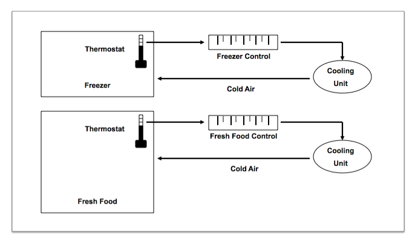

###### Source: The Design of Everyday Things, Donald Norman

---

[.background-color: #FFFFFF]
[.header: #000000, alignment(center)]

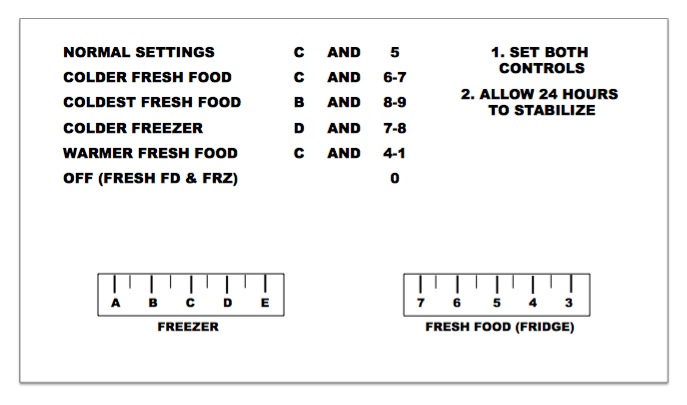

###### Source: The Design of Everyday Things, Donald Norman

---

[.background-color: #FFFFFF]
[.header: #000000, alignment(center)]

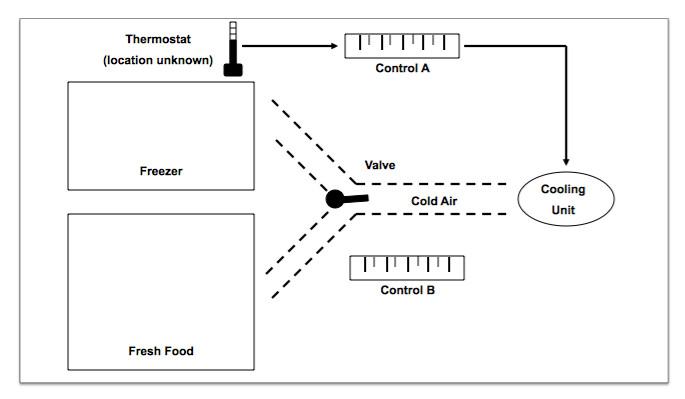

###### Source: The Design of Everyday Things, Donald Norman

---

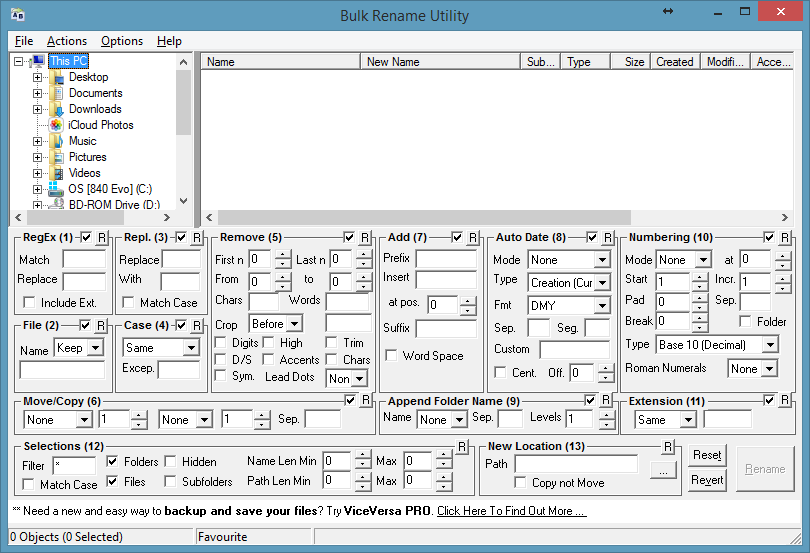

---

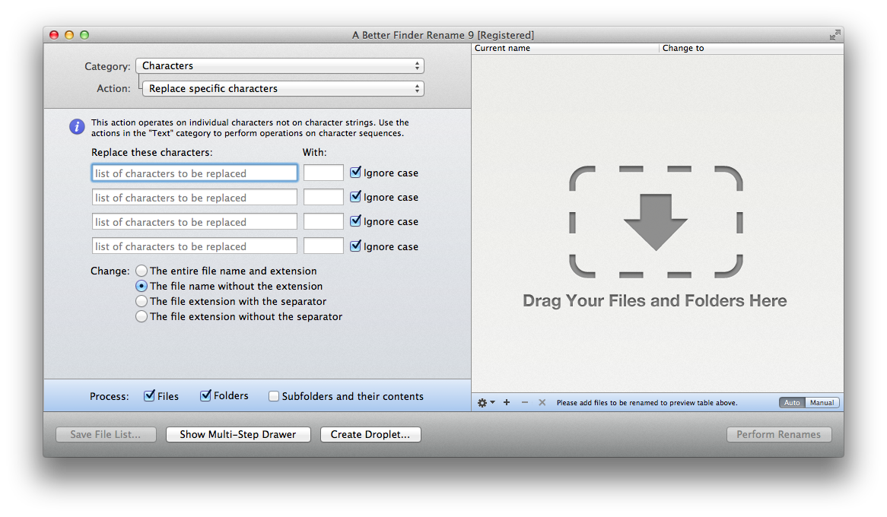

---

# Design Model

The design model (sometimes referred to as the conceptual model) provides an overall framework of how users interact with a product

---

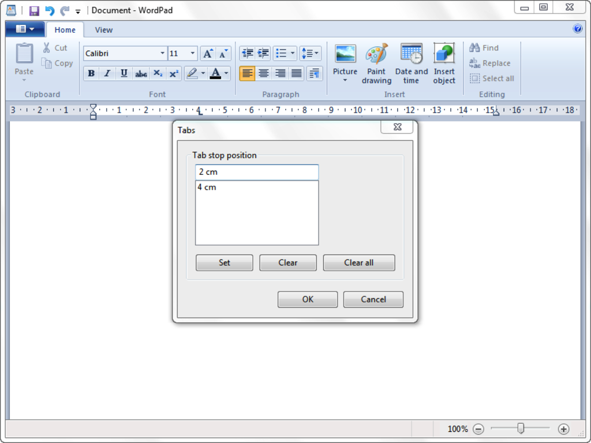

---


---


# General Guidelines for Defining Design Models

* Based on the user’s point of view
* Centered around the user’s goals and tasks
* Easy to understand and remember
* Predictable in behaviour (consistent)

---

# System Image

The system image is the physical appearance of a system, and its operation, responses to user’s commands, and related documentation.

---

[.background-color: #FFFFFF]

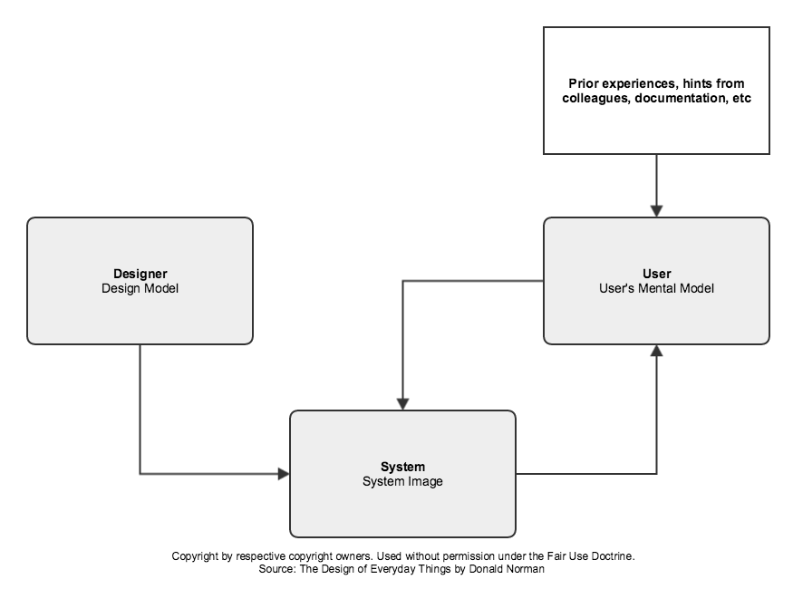

---


# Time for Questions & Discussion

* What we’ve covered so far
 * Mental model
 * Design model
 * System image           
* Coming up
 * Principles to communicate conceptual models

---

[.text: #FFFFFF, line-height(.8)]

# Conceptual Models

Design principles that effectively communicate the conceptual model, as originally identified by Donald Norman:

* Visibility
* Affordances
* Mapping
* Feedback
* Constraints

---

# Visibility

Elements of the interface, representing the various functions of a device, should be visible

---

# Visibility

Examples of poor visibility can be found in many office phone systems and digital wrist watches

---


---

# Visibility

Making everything visible at once is not really feasible, as the issue of relative visibility also needs to be considered

---

[.background-color: #FFFFFF]


---

[.background-color: #FFFFFF]


---


---


---


---

# Progressive Disclosure

Progressive disclosure is a technique where the complexities of the interface are “revealed” as related functionality is required

---


# Effective Progressive Disclosure

* Most important/frequently used items should be immediately accessible
* Display as little, but all required, elements
* Give cues about how to find more functionality

---

# Visibility

For today’s multi-touch devices, the issue of discoverability is a related key factor to also consider

---


---

# Affordances

Affordances are the actual and perceived properties of an object that provide cues about how that object can be used and the results produced by that object

---


---


---

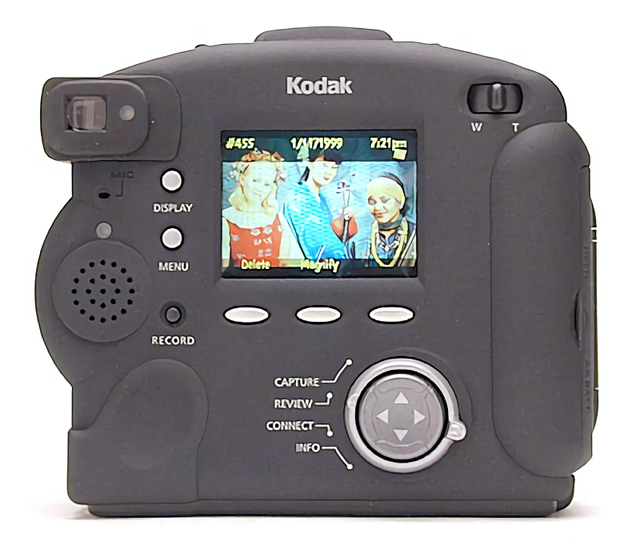

---

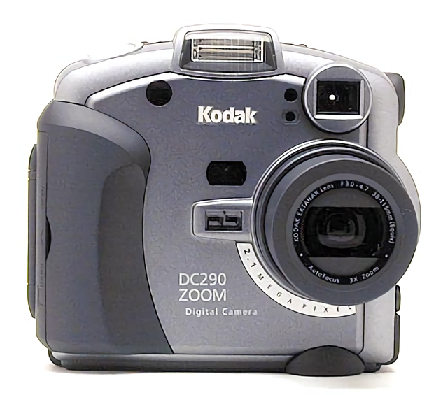

---

# Perceived Affordances

For graphical user interfaces, perceived affordances come into play – a combination of what you see and what you know (conventions)

---

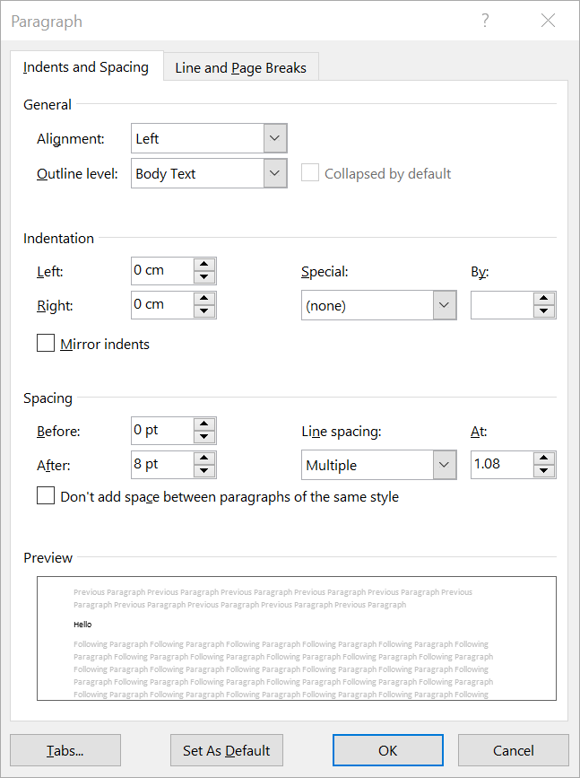

---

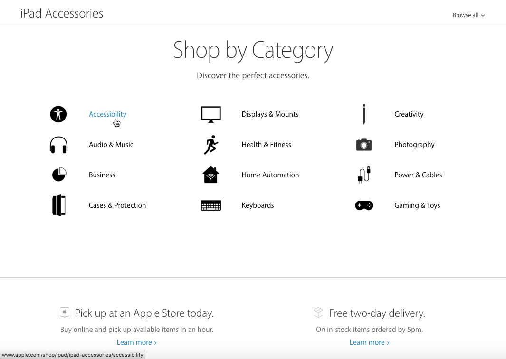

---

# Mapping

Mapping concerns itself with the relationship between controls and the objects that  they affect

---

# Mapping

Ideally, one control affects one object

---

[.background-color: #FFFFFF]


---

> “On our 900’s the replay function jumped back just enough to compensate for our reaction time when the commercial is over and we want to go back to watching the recording. It worked great! Now, on the Smart Control those functions are on dual function keys. **When holding the rewind button long enough to trigger the replay function** the fast forward keeps going, effectively increasing the effective reaction time so that I need at least 3 replays to get back to the portion of the program I missed. This design ‘feature’ was a really dumb idea for keys that depend on reaction time. A remote big enough for the extra 2 keys would have been much better.”  
– Logitech Harmony Smart Control Reviewer

---

# Natural Mapping

Natural Mapping is the spatial relationship between controls and the objects that they affect

---

# Natural Mapping

This may involve both control layout and movement

---

[.background-color: #FFFFFF]

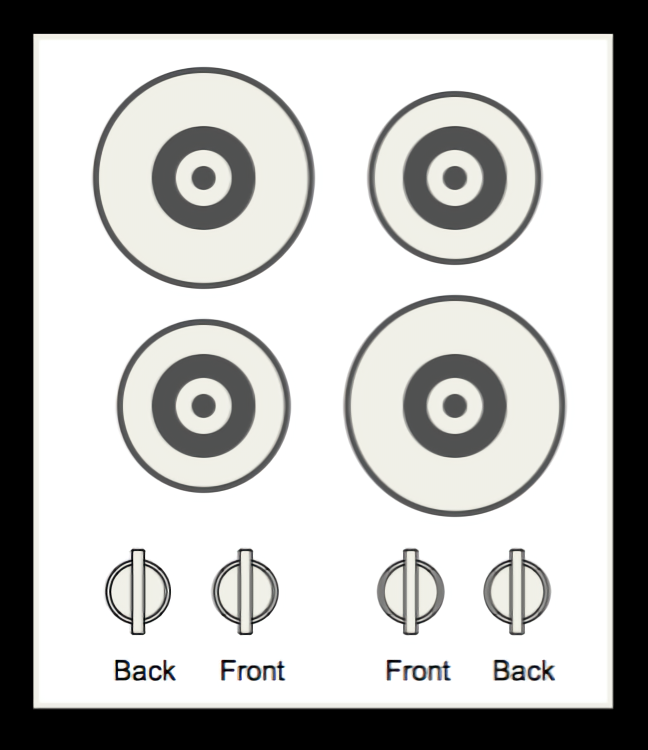

---

[.background-color: #FFFFFF]

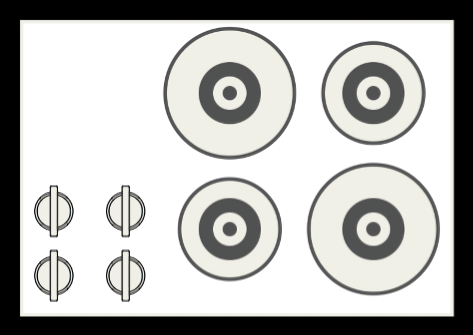

---

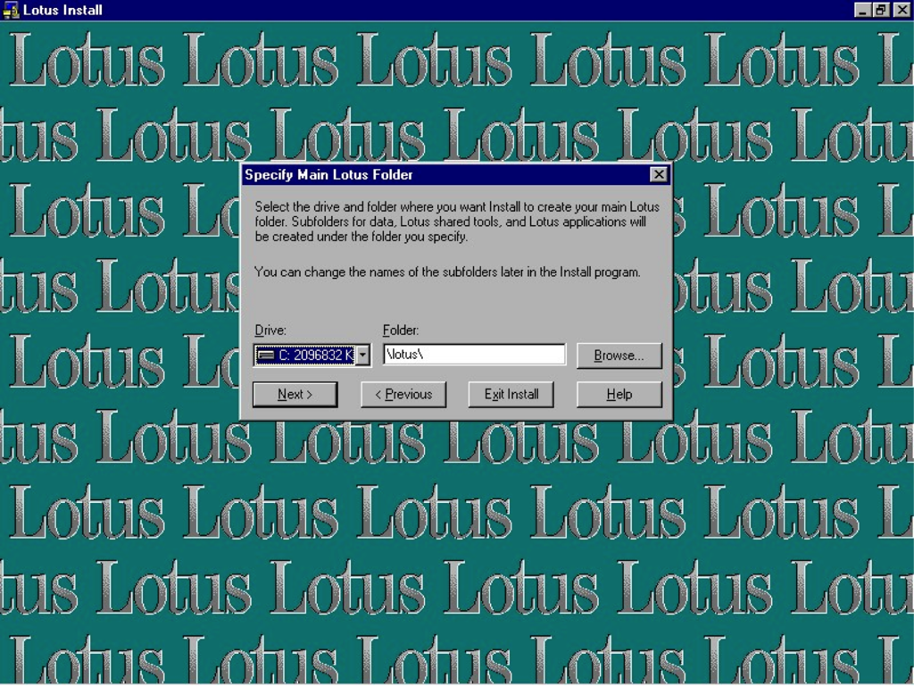

---


---


---

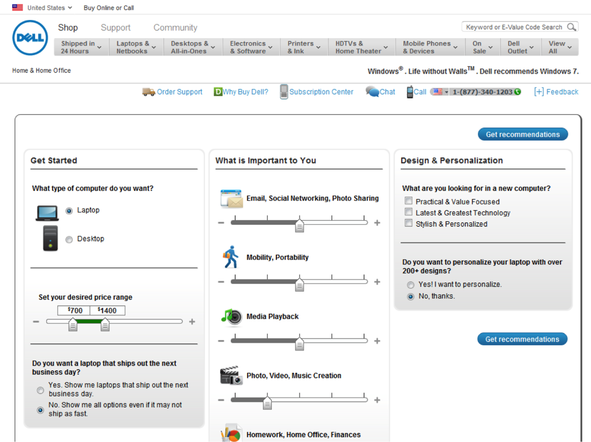

---


---


---


---

[.background-color: #FFFFFF]

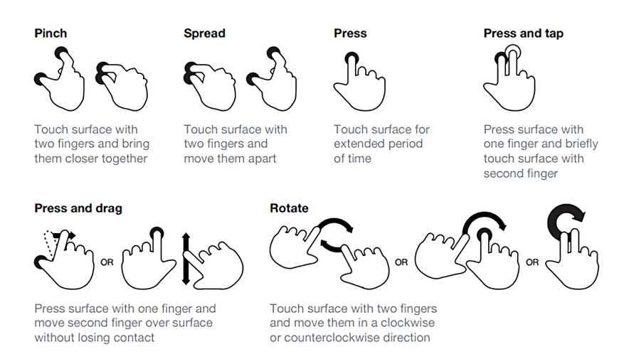

---

# Feedback

Information reported to the user indicating that an action has been performed and what its result has been

---

# Feedback

Common techniques with regard to software interfaces include cursor changes, progress meters, message boxes, and previews

---


---

# Constraints

Constraints limit the number of ways that something can be used

---


# Constraints

* Physical
* Cultural
* Logical

---

[.background-color: #FFFFFF]

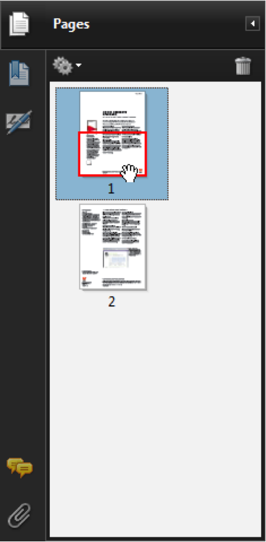

---

[.background-color: #FFFFFF]


---

[.background-color: #FFFFFF]

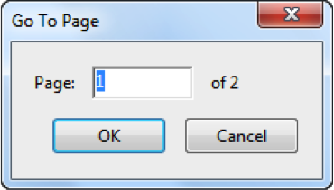

---


# Good Design

* Provides a good conceptual model
* Makes things visible
* Provides (perceived) affordances
* Gets the mappings right
* Supports interaction through feedback
* Exploits the power of constraints

---

[.background-color: #2d6e92]
[.header: alignment(left),#FFFFFF]
[.text: #FFFFFF]

# Activity: Conceptual Model Analysis

PROJECT GROUP  

Review the current myExperience Web app, and consider the following aspects of the design:  

Is a good conceptual model provided?  
Are things visible? Is relative visibility considered?     
Are (perceived) affordances utilized?  
Are the mappings right?  
Is interaction through feedback supported?  
Are the power of constraints utilized?

---

[.background-color: #611036]
[.header: alignment(left),#FFFFFF]

# Conceptual Models and Design

### Designing for Emotion

---


# Why Design for Emotion?[^1]

* Emotion is experience
* All design is emotional design
* Emotion dominates decision-making
* Emotion commands attention and
affects memory
* Emotion communicates personality, forms relationships, and creates meaning

[^1]: As defined by Trevor van Gorp and Edie Adams


---

[.text: alignment(center)]


###### [https://www.youtube.com/watch?v=G7MeRkDkRN4](https://www.youtube.com/watch?v=G7MeRkDkRN4)

---

[.background-color: #FFFFFF]


---


# Three levels of Emotional Design

* Visceral
 * Look
 * Feel
 * Sound
* Behavioral
 * Function
 * Understandability
 * Usability
 * Physical feel
* Reflective
 * Message
 * Meaning of product
 * Culture

---

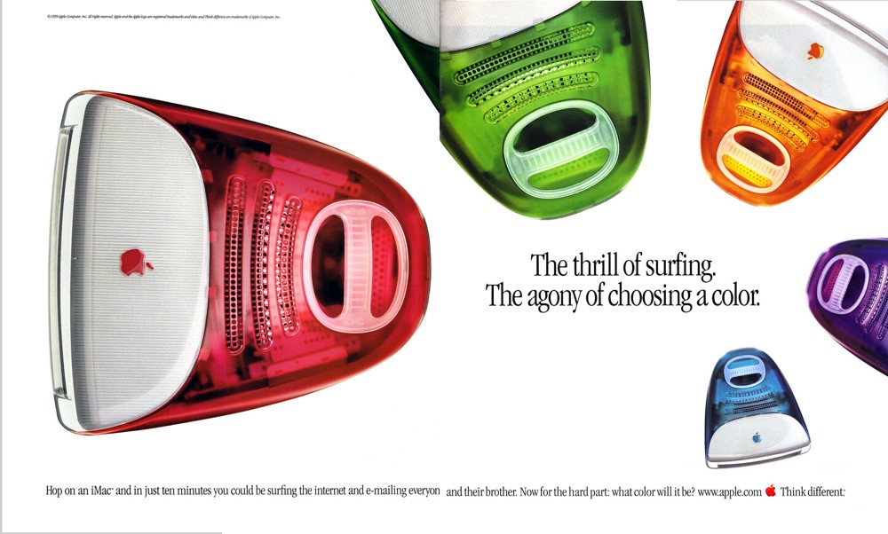

---


---


---


---


# Enjoyable Web Sites

* Easy to Use
* Aesthetically pleasing
* Needed information
* Fun and entertaining
* Provides engagement
* Supports “flow”

---


---

[.background-color: #2d6e92]
[.header: alignment(left),#FFFFFF]
[.text: #FFFFFF]

# Case Study: Designing for Emotion

[Wufoo.com](https://www.wufoo.com/form-builder/)

---


# Time for More Questions & Discussion

* What we’ve covered so far
 * Why design for emotion
 * Three levels of emotional design:     
  * Visceral
  * Behavioral
  * Reflective
* Coming up
 * Accessible and Inclusive Design

---

[.background-color: #611036]
[.header: alignment(left),#FFFFFF]

# Conceptual Models and Design

### Accessible and Inclusive Design

---

# What is Accessible Design?

Accessibility is the practice of removing barriers that prevent interaction or access to websites by people with disabilities

---

# What is Accessible Design, in Plain Language

Content and functionality should be available to everyone!

---


---


# Aspects of Accessibility (a.k.a. a11y)

* Visual
* Audio
* Mobility
* Cognition

---

[.text: alignment(center)]


###### [https://www.youtube.com/watch?v=8Ik_LHmZx8Y](https://www.youtube.com/watch?v=8Ik_LHmZx8Y)

---


---


---


# Example Web Accessibility Issues

* Contrast
* Color-only coding
* Text size/scaling
* Clean presentation
* Page structure
* Link labels
* Image tags
* Mouse-only interaction
* Small touch targets

---


---

[.text: #FFFFFF, line-height(.8)]

# Web Content Accessibility Guidelines (WCAG)

https://www.w3.org/WAI/intro/wcag

---


# WCAG Principles

* Perceivable
* Operable
* Understandable
* Robust

---

# Perceivable

Information and user interface components must be presentable to users in ways they can perceive

---

# Operable

User interface components and navigation must be operable

---

# Understandable

Information and the operation of user interface must be understandable

---

# Robust

Content must be robust enough that it can be interpreted reliably by a wide variety of user agents, including assistive technologies

---

# _By improving accessibility, we can make things better for everyone_

---

[.background-color: #2d6e92]
[.header: alignment(left),#FFFFFF]
[.text: #FFFFFF]

# Activity: Accessibility Audit

PROJECT GROUP  

Perform an accessibility audit on the myExperience Web app, considering the aspects of accessibility highlighted in today’s handout.

---

# What is Inclusive Design?

The design of products and services that consider the full range of peoples ability, age, culture and language

---


# Example Inclusive Design Principles (Microsoft [^1])

* Recognize exclusion
* Learn from diversity
* Solve for one, extend to many

[^1]: https://www.microsoft.com/design/inclusive/

---


---

[.text: alignment(center)]


###### [https://vimeo.com/138670685](https://vimeo.com/138670685)

---

[.background-color: #618B25]


# Summary

1. Conceptual Models  
2. Designing for Emotion  
3. Accessible and Inclusive Design

---

[.background-color: #888888]
[.header: #FFFFFF, alignment(left)]


# References and Suggested Books

* Design for Emotion by Trevor van Gorp and Edie Adams
* A Web for Everyone: Designing Accessible User Experiences by Sarah Horton and Whitney Quesenbery
* Understanding WCAG 2.0, https://www.w3.org/TR/UNDERSTANDING-WCAG20/intro.html
* Designing User Interfaces for an Aging Population by Jeff Johnson and Kate Finn
* Emotional Design by Donald Norman
* The Design of Everyday Things by Donald Norman
* The Usability Engineering Lifecycle by Deborah Mayhew

---

[.background-color: #888888]
[.header: #FFFFFF, alignment(left)]

# Image Credits

```
http://brightenstudios.com/blog/2013/4/9/hicks-law-applied-to-application-design   
http://architectingusability.com/2012/06/11/how-users-skills-and-competence-improve-with-practice/  
The Design of Everyday Things by Donald Norman  
Amazon Design Team  
http://www.joelonsoftware.com/uibook/chapters/fog0000000060.html  
https://uxplanet.org/pull-to-refresh-ui-pattern-42a85f671cdf
http://www.lukew.com/ff/entry.asp?1071   
https://www.interaction-design.org/literature/article/the-reflective-level-of-emotional-design
https://www.sarasoueidan.com/blog/lessons-from-seductive-interaction-design-book/  
https://interestingengineering.com/20-struggles-only-left-handed-people-will-understand
https://www.themanual.com/living/us-six-flags-parks-ranked/
https://mattlandau.com/flow/
http://www.inclusivedesigntoolkit.com/whatis/whatis.html#nogo  
https://twitter.com/msftenable/status/755502303952580610
https://designhammer.com/blog/difference-between-web-accessibility-usability  
https://pixabay.com/en/mobile-iphone-apple-5s-girl-hand-666896/
http://www.inclusivedesigntoolkit.com/whatis/whatis.html#nogo  
```
