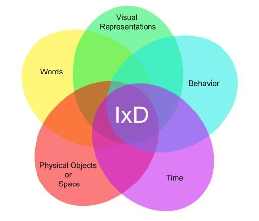
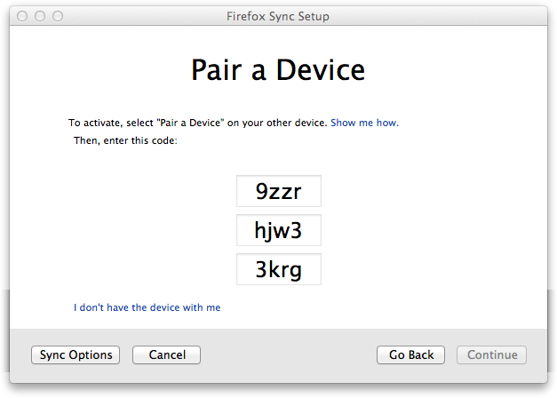
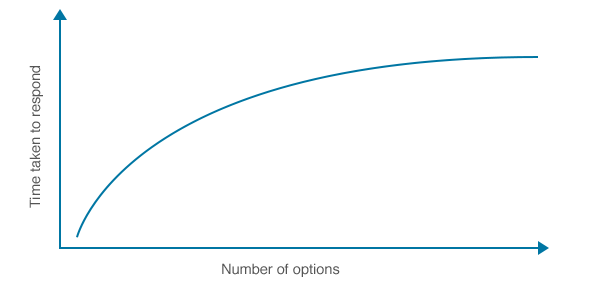
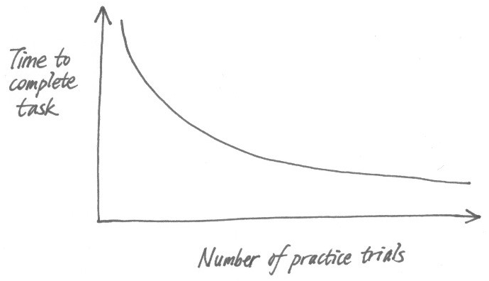
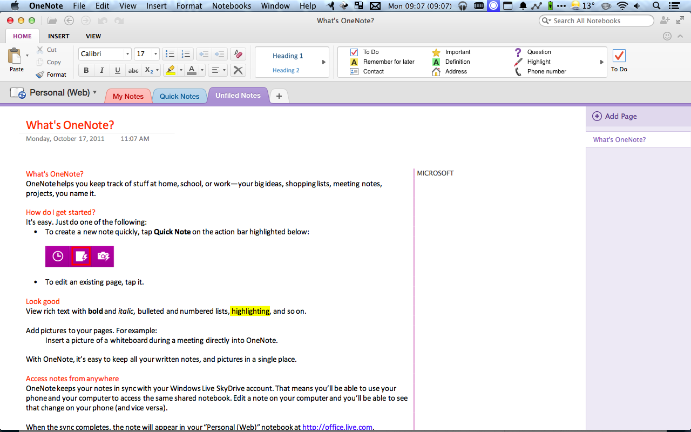
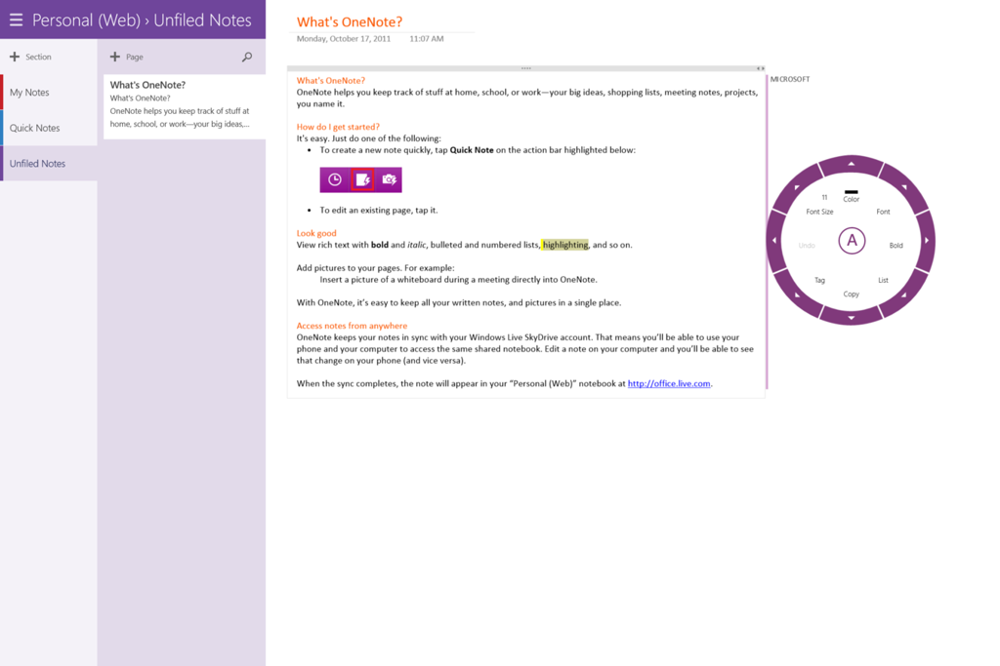

[.header: alignment(center)]
[.text: alignment(center)]

# Interaction Design

### CMPT 363

> “You only use what you understand.”  
– Steve Jobs

---

[.background-color: #618B25]
[.header: alignment(left),#FFFFFF]

# _What is the practice of strategic **interaction design**?_

---

[.background-color: #FFFFFF]


---

[.background-color: #618B25]
[.header: alignment(left),#FFFFFF]


# Topics to Explore

1. 5 Dimensions of IxD  
2. HCI Laws  

---

[.background-color: #611036]
[.header: alignment(left),#FFFFFF]

# Interaction Design

### 5 Dimensions of IxD  

---

[.background-color: #FFFFFF]



---

# 1D: Words

Includes all text visible to the user.    

---

# 2D: Visual representations

Includes typography, imagery, icons, color palette, etc.

---

# 3D: Physical objects or space

Includes computer keyboards, mice, trackpads, and touchscreens that users interact with and the space they interact within.

---

# 4D: Time

Includes all interactive elements that change over time, such as motions, sounds, and animations.

---

# 5D: Behaviour

Includes how users react to an interaction - physically and emotionally.

---

[.background-color: #2d6e92]
[.header: alignment(left),#FFFFFF]
[.text: #FFFFFF]

# Activity: 5 Dimensions of IxD

Access the 5 dimensions of an interface of your choice.

* 1D: Words
* 2D: Visual representations
* 3D: Physical objects or space  
* 4D: Time
* 5D: Behaviour

---

[.background-color: #611036]
[.header: alignment(left),#FFFFFF]

# Interaction Design

### HCI Laws

---

# HCI Laws

* Miller's Law
* Hick's Law
* Power Law of Practice
* Fitts' Law

---

# Miller's Law

In 1956, George Miller published the paper "The Magical Number Seven, Plus or Minus Two: Some Limits on Our Capacity for Processing Information"

---

# Miller's Law

More recent research (Baddeley, 1986) indicates the capacity is closer to 3-4 items

---

# Miller's Law

The ability of working memory to store short-term information can be increased by "chunking" data

---



---

# Hick's Law

Hick's law estimates the time it takes for a person to make a choice as a result of the number of possible choices presented

---

# Hick's Law

T = b log2(n + 1)

b = empirically determined constant
n = number of choices

---

[.background-color: #FFFFFF]



---

# Power Law of Practice

Mathematically expresses that performing the same physical action over a period of time tends to increase performance

---

# Power Law of Practice

Time n = Time 1* n-.4

Time 1 is first time to perform task, n is number of trails
Time n is time to perform task after n times

---

[.background-color: #FFFFFF]



---

# Fitts' Law

Fitt’s law (1954) is a model of human movement

---

# Fitt's Law

T = k log2(D/S + 0.5), k ~ 100 msec.

T = Time to move the hand to target
D = distance between hand and target
S = size of target

---

[.text: alignment(center)]


###### [https://www.youtube.com/watch?v=95RoKSFyQ_k](https://www.youtube.com/watch?v=95RoKSFyQ_k)

---

[.background-color: #2d6e92]
[.header: alignment(left),#FFFFFF]
[.text: #FFFFFF]

# Activity: Fitts' Law

Compare two variations of a user interface, based on the application of Fitts' Law

---


---



---


---



---

[.background-color: #618B25]


# Summary

1. 5 Dimensions of IxD  
2. HCI Laws  

---

[.background-color: #888888]
[.header: #FFFFFF, alignment(left)]


# References and Suggested Books

* Design for Emotion by Trevor van Gorp and Edie Adams
* Designing Interactions by Bill Moggridge
* A Web for Everyone: Designing Accessible User Experiences by Sarah Horton and Whitney Quesenbery
* Understanding WCAG 2.0, https://www.w3.org/TR/UNDERSTANDING-WCAG20/intro.html
* Designing User Interfaces for an Aging Population by Jeff Johnson and Kate Finn
* Emotional Design by Donald Norman

---

[.background-color: #888888]
[.header: #FFFFFF, alignment(left)]

# Image Credits

```
https://www.interaction-design.org/literature/article/the-five-languages-or-dimensions-of-interaction-design
https://www.interaction-design.org/literature/article/the-reflective-level-of-emotional-design
https://www.sarasoueidan.com/blog/lessons-from-seductive-interaction-design-book/  
https://interestingengineering.com/20-struggles-only-left-handed-people-will-understand
https://www.themanual.com/living/us-six-flags-parks-ranked/
https://mattlandau.com/flow/
http://www.inclusivedesigntoolkit.com/whatis/whatis.html#nogo  
https://twitter.com/msftenable/status/755502303952580610
https://designhammer.com/blog/difference-between-web-accessibility-usability  
https://pixabay.com/en/mobile-iphone-apple-5s-girl-hand-666896/
http://www.inclusivedesigntoolkit.com/whatis/whatis.html#nogo  
http://brightenstudios.com/blog/2013/4/9/hicks-law-applied-to-application-design   
http://architectingusability.com/2012/06/11/how-users-skills-and-competence-improve-with-practice/  
```
