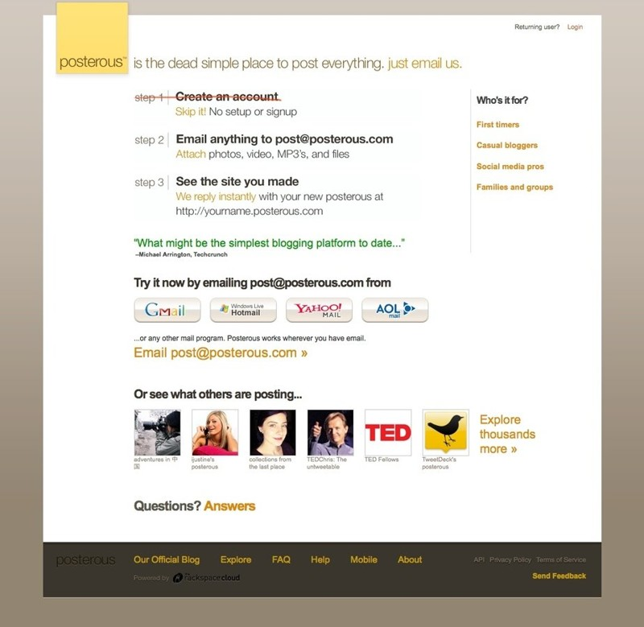
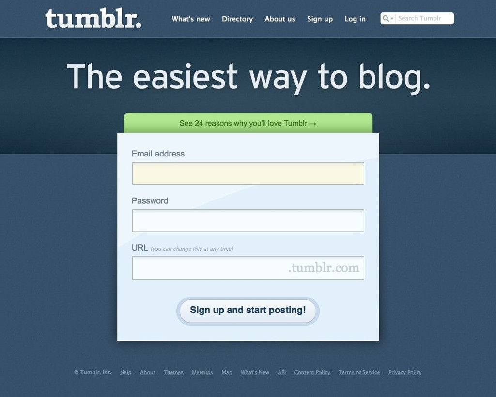

[.header: alignment(center)]
[.text: alignment(center)]

# Introduction to UX

### CMPT 363

> “When creating great experiences, it’s not so much about doing what users expect. Instead, it’s about creating a design that clearly meets their needs at the instant they need it.”  
– Jared Spool

---

[.background-color: #618B25]

# What is user experience design?

---

[.background-color: #618B25]

# Topics to Explore  

1. HCI, UI, IA, IxD and UX  
2. Design Thinking  
3. Usability and UCD

---

[.background-color: #611036]

# What is user experience design?

### HCI, UI, IA, IxD, and UX

---

# What is Human-Computer Interaction?

---

# What is Human-Computer Interaction?

A field of study which strives to make interactions between people and computers more effective

---

[.background-color: #FFFFFF]


---

[.background-color: #FFFFFF]

  


---

[.background-color: #FFFFFF]


---

[.background-color: #FFFFFF]


---

# Contemporary HCI Issues (Yvonne Rogers)

- Turn to design (user experience, enjoyment, play and pleasure)
- Turn to culture (human conditions and nature)
- Turn to the wild (augmenting people, places and settings)
- Turn to embodiment (practical engagement with social and physical environment)

---

[.background-color: #FFFFFF]


---

# What is a User Interface?

---

# What is a User Interface?

All elements which provide communication between the interactive system and the user

---

[.background-color: #FFFFFF]


---

# What is User Interface Design?

---

# What is User Interface Design?

User interface design is the process of supporting the *goals* of the user, ideally in a *friendly and articulate* manner

---

[.background-color: #2d6e92]

# Activity: User Interface Design Case Study

[HipMunk.com](http://hipmunk.com)

---

# What is Information Architecture (IA)?

---


---

[youtube]https://www.youtube.com/watch?v=TbEfjaE94sU[/youtube]

---

# Next Up,<br>What is Interaction Design (IxD)?
<br><br>

---

# Next Up,<br>What is Interaction Design (IxD)?

The *structure* and *behaviours* of an interactive product, service, or system

---

# Interaction Design Association: 2018 Interaction Design Awards

Founded by the [Interaction Design Association](http://www.ixda.org/) (IxDA) in 2010 and first presented in 2012, the annual [Interaction Awards](http://awards.ixda.org/) celebrate design thought leadership and innovation around the globe. Each year, award recipients comprise a showcase demonstrating how interaction design impacts and improves human lives.

---

<div style="padding:40% 0 0 0;position:relative;"><iframe src="https://player.vimeo.com/video/240137191" style="position:absolute;top:0;left:0;width:100%;height:100%;" frameborder="0" webkitallowfullscreen mozallowfullscreen allowfullscreen></iframe></div>

---

<div style="padding:40% 0 0 0;position:relative;"><iframe src="https://player.vimeo.com/video/240767296" style="position:absolute;top:0;left:0;width:100%;height:100%;" frameborder="0" webkitallowfullscreen mozallowfullscreen allowfullscreen></iframe></div>

---

# How Can We Define User Experience?

---

# How Can We Define User Experience?

> “A person’s perceptions and responses that result from the use or anticipated use of a product, interactive system, or service.”  
– ISO 9241-210

---

[.background-color: #FFFFFF]


---

[.background-color: #2d6e92]

# Activity: User Experience

THINK-PAIR-SHARE  
What are some examples of good or bad user experiences?

---

[youtube]https://www.youtube.com/watch?v=2lXh2n0aPyw[/youtube]

---

[youtube]https://www.youtube.com/watch?v=Xo0CiJjTGJE[/youtube]

---

[.background-color: #FFFFFF]


---


# Time for Questions & Discussion

- What we’ve covered so far
 - What is human-computer interaction?
 - What is a user interface?
 - What is user interface design?
 - What is information architecture?
 - What is interaction design?
 - What is user experience design?                
- Coming up
 - What is design thinking?

---

[.background-color: #611036]

# What is user experience design?

### Design Thinking

---

# What is Design Thinking?

- Not a type of thinking, but more of a mindset
- Process plays a role, similar user-centered design
- Anthropology and Sociology also play a role

---

# Design Thinking

> “Design thinking is a human-centered approach to innovation that draws from the designer’s toolkit to integrate the needs of people, the
possibilities of technology, and the requirements for business success.”
– Tim Brown (President and CEO of IDEO)

---

[.background-color: #FFFFFF]


---

# The Three Goals of Design Thinking

- To be desirable by people
- To be technologically feasible
- To be economically viable

---

[.background-color: #FFFFFF]


---

# Elements of Design Thinking

- Empathize
- Synthesize (i.e. Frame)
- Ideate / Brainstorm
- Prototype / Evaluate

---

[youtube]https://www.youtube.com/watch?v=nPlvBPtxEl4[/youtube]

---

[.background-color: #FFFFFF]


---

[.background-color: #FFFFFF]


---

[.background-color: #FFFFFF]


---

[.background-color: #2d6e92]

# Activity: Design Thinking vs. UX Design

THINK-PAIR-SHARE  
Compare design thinking to user experience design

---

# A Selection of Design Thinking Methods

- 5 Whys
- Interviews (discussed week 3)
- Empathy map (discussed week 5)
- Journey map (discussed week 3)
- Personas (discussed week 5)
- Powers of 10 (Zoom in/out)
- Sketching (discussed in week 2, and more to come...)
- Prototyping (discussed in week 2, and more to come...)
- Testing with users (discussed week 2, and more to come...)

---

# Five Whys

A technique to help reveal cause and effect, through asking “Why?” often in five iterations (part of the “[Toyota Way](http://en.wikipedia.org/wiki/The*Toyota*Way)”)

---

[youtube]https://www.youtube.com/watch?v=zvkYFZUsBnw[/youtube]

---

# Zoom In/Out

---

[youtube]https://www.youtube.com/watch?v=0fKBhvDjuy0[/youtube]

---

# Time for Questions & Discussion

- What we’ve covered so far
 - What is design thinking?
 - Five whys
 - Zoom in/out              
- Coming up
 - What is usability?

---

[.background-color: #611036]

# What is user experience design?

### Usability and UCD

---

# What is Usability?

---



---



---

# Usability Means...

---

# Usability Means...

Usability means that a person using a system finds it easy to understand and use

---

# Usability Means...

A usable system allows a person to focus on their tasks, and not on the system itself

---

# Usability Means...

A usable system most often does what a person expects

---

[.background-color: #FFFFFF]


---

# What is Usability?

More specifically, usability can be defined as:

- A measurement
- A design approach

---

# Usability as a Measurement (as defined by Jakob Nielsen)

- Learnability
- Efficiency
- Memorability
- Error Rate
- Satisfaction

---

# Learnability

Learnability – how easy is it for novice users to work with the system?

---

# Efficiency

Efficiency – how efficient is it for experienced users to work with the system?

---

# Memorability

Memorability – how easy is it for less frequent users to remember how to use the system?

---

# Error Rate

Error Rate – how many errors (on average) do users make when working with the system?

---

# Satisfaction

Satisfaction – how pleasant do users find the system to work with?

---

[.background-color: #2d6e92]

# Activity: Usability Elements

How would we consider trade-offs, such as Learnability vs Efficiency?

---


---

# Time for More Questions & Discussion

- What we’ve covered in this section
 - Overview of usability​
 - Usability as a measurement
 - Usability iceberg
- Coming up
 - Usability as a design approach

---

# Usability as a Design Approach

- User-centered design (UCD)
- Both a methodology and philosophy

---


---

[.build-lists: true]

# Designing a Useful Product (by Scott McGregor)

1. Internal combustion engine
2. Four wheels with rubber tires
3. A transmission connecting the engine to the drive wheels
4. Engine and transmission mounted on a metal chassis
5. A steering wheel
<br>
<br>

---

# Designing a Useful Product (by Scott McGregor)

1. Internal combustion engine
2. Four wheels with rubber tires
3. A transmission connecting the engine to the drive wheels
4. Engine and transmission mounted on a metal chassis
5. A steering wheel
6. To cut grass quickly and easily
7. To be comfortable to sit on

---

# Aspects of an Enjoyable Product

- Aesthetics
- Appeal
- Delight
- Fun
- Engagement
- Emotions

---

[.background-color: #2d6e92]

# Case Study: Making an Enjoyable Product

[Mailchimp.com](http://www.mailchimp.com)

---

[.background-color: #FFFFFF]


---

[.background-color: #FFFFFF]


---

[.background-color: #FFFFFF]


---

[.background-color: #618B25]


# Summary

- HCI, UI, IA, IxD and UX
- Design Thinking
- Usability and UCD

---

[.background-color: #888888]

# References and Suggested Books

- A Project Guide to UX Design: For user experience designers in the field or in the making by Russ Unger and Carolyn Chandler
- Change by Design by Tim Brown
- Don’t Make Me Think: A Common Sense Approach to Web Usability, 2nd Edition by Steve Krug
- d.school bootcamp bootleg by The d.school (PDF)
- From Tool to Partner: The Evolution of Human-Computer Interaction, Jonathan Grudin (Author) and John M. Carroll (Editor)
- The Design of Everyday Things by Donald A. Norman
- Universal Principles of Design by William Lidwell, Kritina Holden, and Jill Butler
- Usability Engineering by Jacob Nielsen
- Useful Usability: Simple Steps For Making Stuff Better by Eric Reiss

---

[.background-color: #888888]

# Image Credits

```
https://en.wikipedia.org/wiki/Grace_Hopper
https://en.wikipedia.org/wiki/Douglas_Engelbart
https://www.interaction-design.org/literature/book/the-encyclopedia-of-human-computer-interaction-2nd-ed/human-computer-interaction-brief-intro
https://foundationsofhci.wordpress.com/
https://user-prompt.com/de/style-the-guide-a-new-hig-for-kde-is-in-preparation/
http://www.uxbooth.com/articles/complete-beginners-guide-to-information-architecture/
http://intertwingled.org/user-experience-honeycomb/
http://www.kickerstudio.com/2008/12/the-disciplines-of-user-experience/
http://www.karelvredenburg.com/home/2016/8/29/design-vs-design-thinking-explained
https://idealog.co.nz/casestudies/tom-kelley-ideo
https://www.forbes.com/sites/reuvencohen/2014/03/31/design-thinking-a-unified-framework-for-innovation/
https://www.possible.com/pov/the-conundrum-of-humdrum-innovation
https://www.nngroup.com/articles/design-thinking/
http://www.thecreativeindustries.co.uk/uk-creative-overview/news-and-views/view-what-is-design-and-why-it-matters
https://uxdesign.cc/designing-ethically-pt-2-535ac61e2992
http://www.uxbooth.com/articles/setting-standards-for-usability-testing/
http://weareinflux.com/useful-usable-desirable/
http://www.wqusability.com/articles/language-usability-tekom-proceedings.html
https://www.tamingdata.com/2010/07/08/the-project-management-tree-swing-cartoon-past-and-present/
http://www.designtos.com/post_user-centered-design-process_23464/
```
