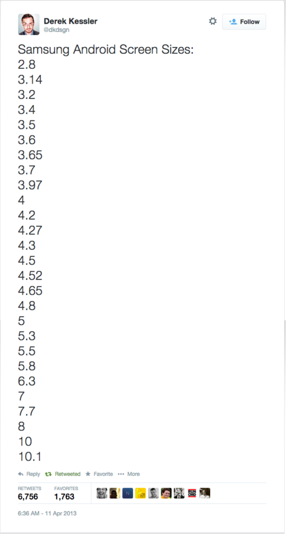
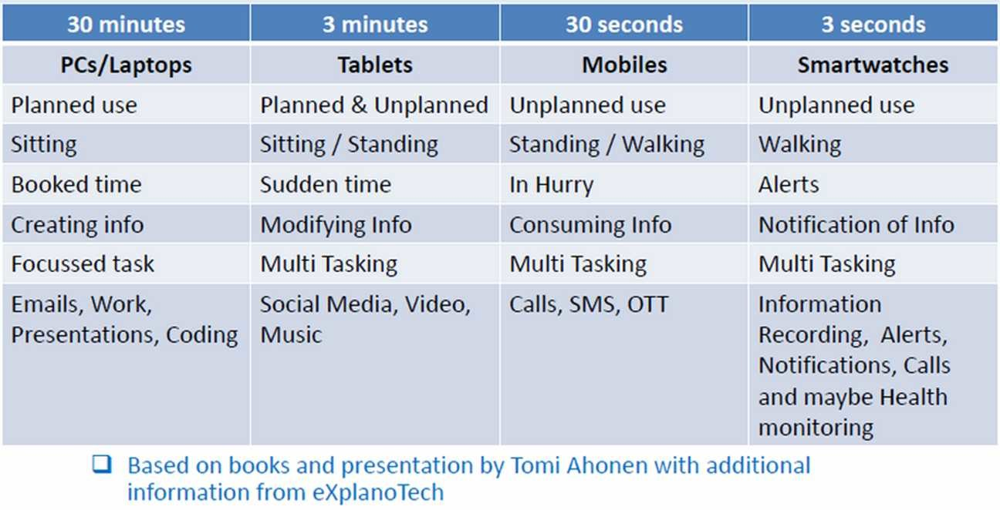
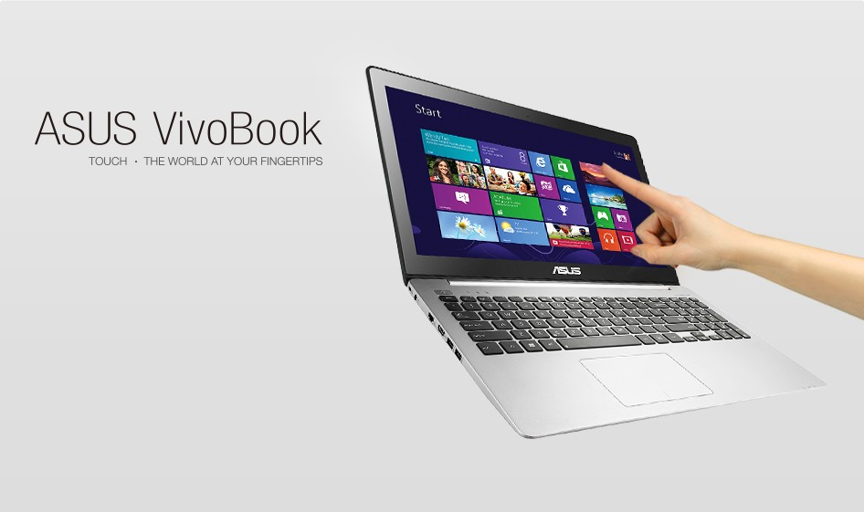
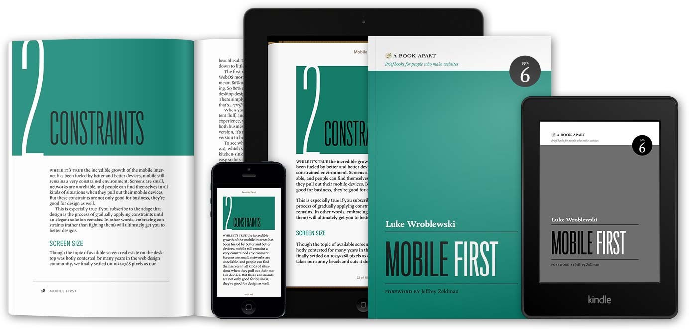
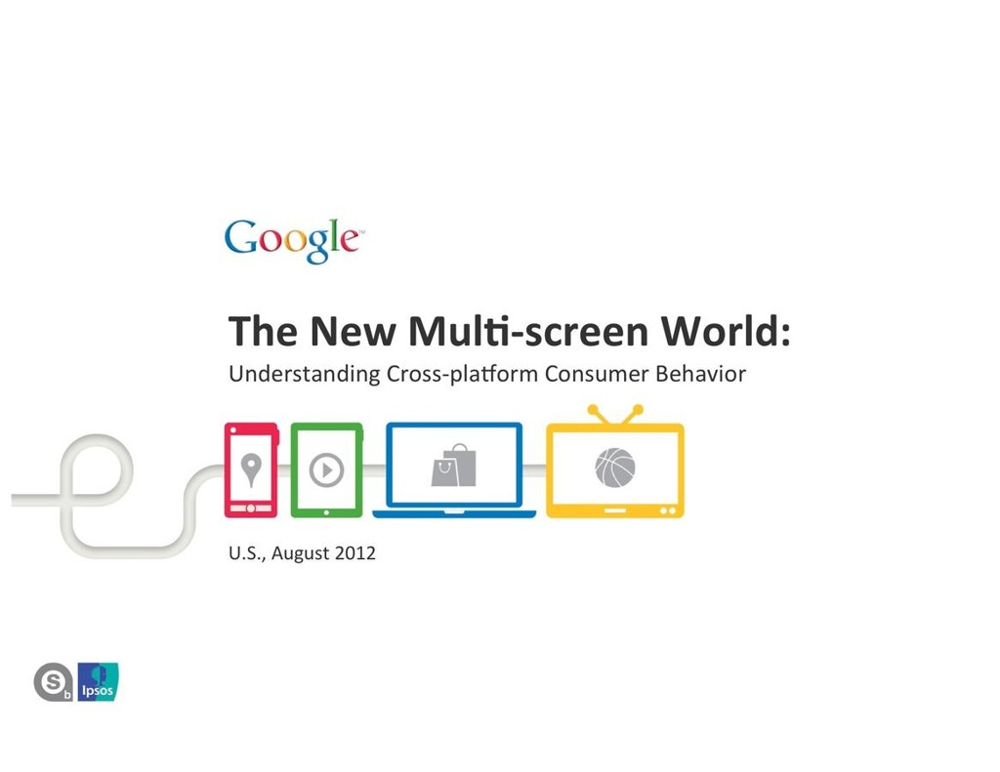
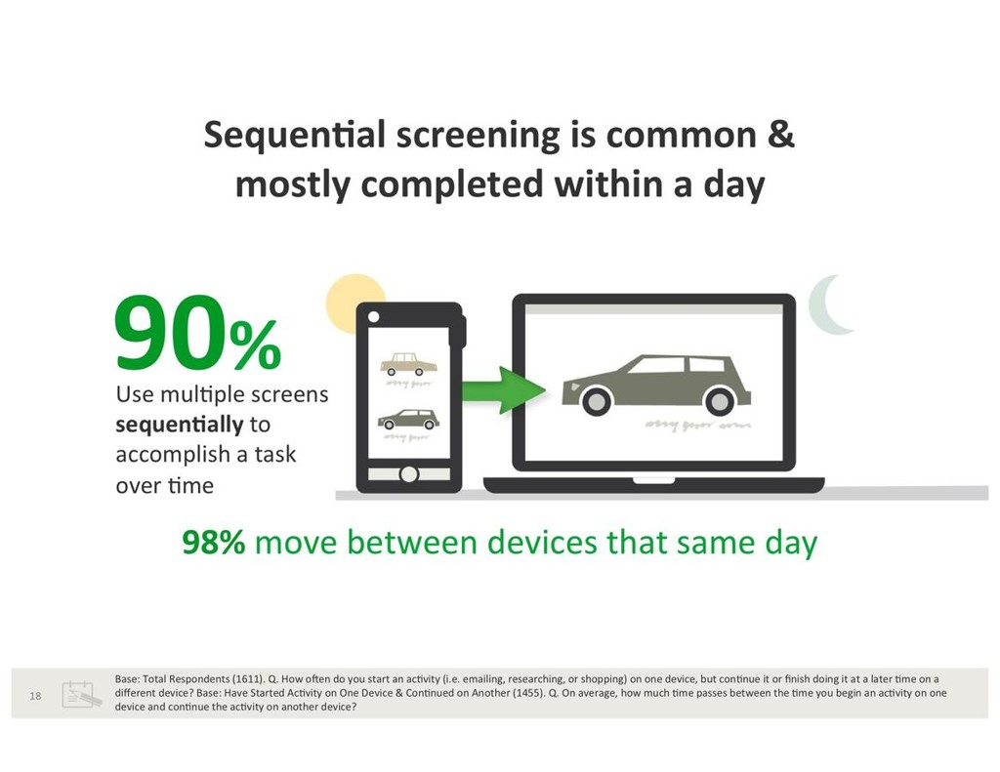
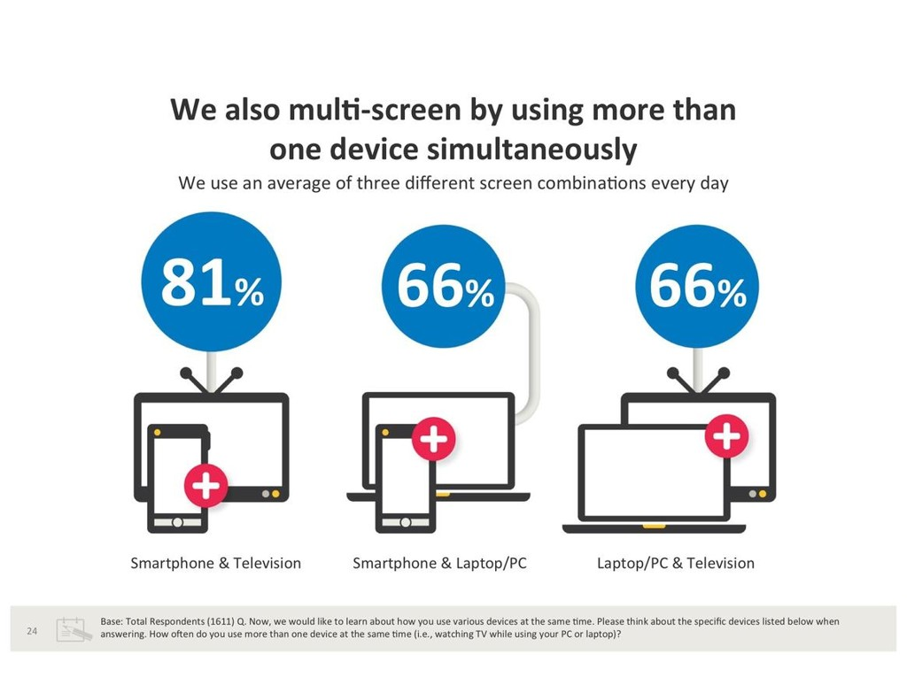
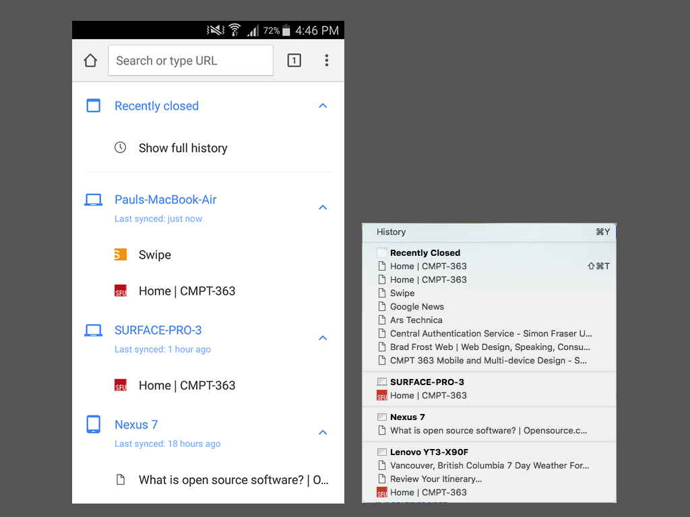
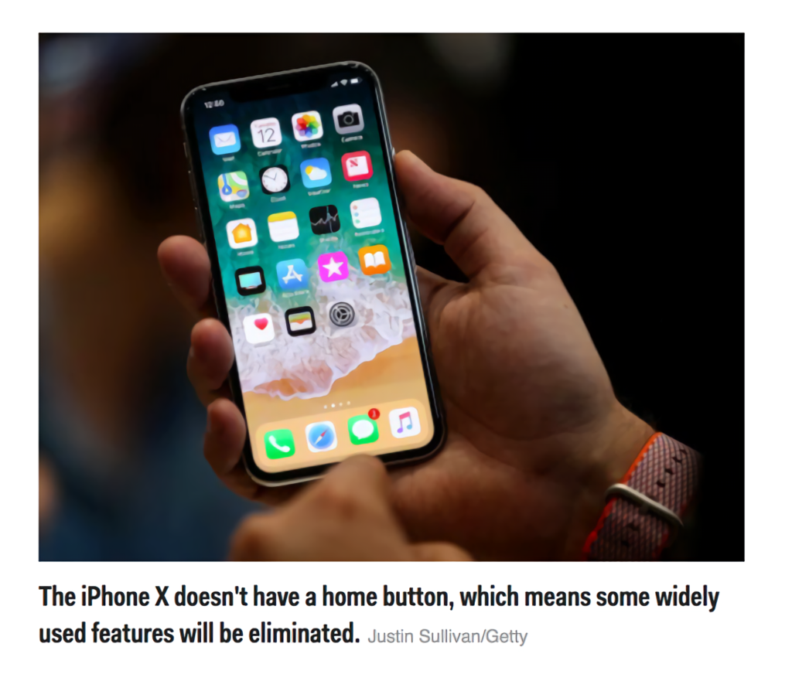
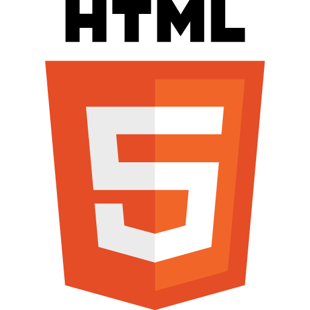

[.text: alignment(center)]

# Mobile and Multi-device Design

### CMPT 363

> “The next generation of users is upon us. Their context is touch, mobility and speed. Reaching them requires intuitive design. For better or worse, they are... Mobile First.”  
– Jon Fox

---

[.background-color: #618B25]

# _How to design for mobile and multi-device usage?_

---

[.background-color: #FFFFFF]


---

[.background-color: #FFFFFF]


---

[.background-color: #618B25]
[.text: #FFFFFF, line-height(.8)]

# Topics to Explore
1. “Mobile” Design   
2. Touch Interaction Design   
3. Responsive Web Design (RWD)

---

[.background-color: #611036]
[.header: alignment(left),#FFFFFF]

# Mobile and Multi-device Design

### “Mobile” Design

---


---


---


---


---

[.background-color: #2d6e92]
[.header: alignment(left),#FFFFFF]
[.text: #FFFFFF]

# Activity: Defining Mobile

What does the term  “Mobile”  mean in 2018?

---



---


---



---


# False Mobile Assumptions

* Being mobile means being in a rush
* Mobile searches are mostly done on-the-go
* Mobile users are ok with having less
* Context is king (instead think about intent)

---



---

# _So, we need to think more about multi-device, and not just mobile_

---

[.text: alignment(center),#FFFFFF]


[https://www.youtube.com/watch?v=WMklcdzcNcU](https://www.youtube.com/watch?v=WMklcdzcNcU)

---

[.text: alignment(center),#FFFFFF]


[https://www.youtube.com/watch?v=oxqH0XDCciY](https://www.youtube.com/watch?v=oxqH0XDCciY)

---



---


# Mobile First

* Mobile First, as defined by Luke Wroblewski in 2009
* Adoption (larger audience for mobile)
* Focus (content and functionality constraints)
* Technologies (touch, geolocation, etc.)

---


---


---


# Mobile First, To Me

* When  the element of mobility is a core value proposition
* Even given that, I prefer the battle cry of Experience First (HT @kevinmpowell) these days... why?
 * Mobile usage (i.e. “on the go”) is context guessing at best
 * No longer a singular mobile device, but a family of devices
 * Since mobile to me is device independent – I define it as  “being close at hand” or “being available”
 * People deserve content/function parity everywhere
 * The best experience should always be leveraged, not constrained, by device attributes

---

[.background-color: #FFFFFF]


---

[.background-color: #FFFFFF]


---

[.background-color: #FFFFFF]



---

[.background-color: #FFFFFF]


---

[.background-color: #FFFFFF]



---

[.background-color: #FFFFFF]



---

[.background-color: #545454]



---


# Multi-device Experience Goals

* Conceptual and visual consistency
* Content and functionality parity
* Seamless task transferability
* Think ecosystem, not isolated devices
* Optimize physical interactions on every device

---


# Google Mobile Design Principles

* Home page and site navigation (1 of 5 categories)
 * Keep calls to action front and center
 * Keep menus short and sweet
 * Make it easy to get back to the home page
 * Don’t let promotions steal the show

[developers.google.com/web/fundamentals/design-and-ux/principles/](https://developers.google.com/web/fundamentals/design-and-ux/principles/)

---


# iOS Mobile Design Principles

* Aesthetic Integrity
* Consistency
* Direct Manipulation
* Feedback
* Metaphors
* User Control

[iOS Design Principles](https://developer.apple.com/ios/human-interface-guidelines/overview/themes/)

---

# _What is common between these two sets of mobile design principles?_

---


# Time for Questions & Discussion

* What we’ve covered so far
 * Mobile usage statistics
 * Expect touchscreens everywhere
 * Do not context guess with “mobile assumptions”
 * Experience first vs. mobile first
 * It is a multi-screen world      
 * Mobile design principles   
* Coming up
 * Touch interaction design

---

[.background-color: #611036]
[.header: alignment(left),#FFFFFF]

# Mobile and Multi-device Design

### Touch Interaction Design

---


---


---


---

[.text: alignment(center),#FFFFFF]


[https://www.youtube.com/watch?v=r3CTKI6pRlQ](https://www.youtube.com/watch?v=r3CTKI6pRlQ)

---

[.text: alignment(center),#FFFFFF]


[https://www.youtube.com/watch?time_continue=1&v=O99m7lebirE](https://www.youtube.com/watch?time_continue=1&v=O99m7lebirE)

---

[.background-color: #FFFFFF]


---

[.background-color: #FFFFFF]


---

[.background-color: #FFFFFF]



---

[.background-color: #2d6e92]
[.header: alignment(left),#FFFFFF]
[.text: #FFFFFF]

# Activity: Small Screen Navigation Case Study

Let’s take a look at a website's level of 'thumb friendliness' on a mobile device...


---


---


---


---

[.text: alignment(center),#FFFFFF]


[https://www.youtube.com/watch?v=jm16qmCXmoY](https://www.youtube.com/watch?v=jm16qmCXmoY)

---


# Essential Touch Interaction Design Guidelines

* Touch Target Size
* Placement of Controls
* Behavior (i.e. no hovers)
* User Effort
* Gestures (i.e. standard and non-standard)

---

# Activity: Touch Interaction Analysis

[.background-color: #2d6e92]
[.header: alignment(left),#FFFFFF]
[.text: #FFFFFF]

INDIVIDUAL, TEAM, OR PROJECT GROUP  

[One-Page Touch Interaction Design Checklist](https://canvas.sfu.ca/courses/38847/files/folder/Handouts/Touch%20Interaction%20Checklist)

Assess touch interaction of SFU’s myExperience Web app

---

[.background-color: #FFFFFF]



---

[.background-color: #FFFFFF]


---

[.background-color: #611036]
[.header: alignment(left),#FFFFFF]

# Mobile and Multi-device Design

### Responsive Web Design (RWD)

---


---


# Responsive Web Design (RWD)

* Content/interface universal for all devices
* One source of content, presented differently
* Key elements
 * CSS media queries
 * Fluid grid layouts
 * Flexible images and media

---


---


# My RWD Design Process

* Discover (always lots to learn...)
* List and prioritize the content (nothing fancy)
* Development
 * Sketch (content placeholders, mostly for breakpoints)
 * Wireframe (a teeny bit really, sometimes none)
 * Visual Design (rough layout colour comps, maybe)
 * Prototype (a whole lot, and then some more!)
 * Test (rinse and repeat as needed)
* Deliver

---

[.header: #FFFFFF, alignment(center)]
[.text: #FFFFFF, alignment(center)]

# Responsive Web Design Sketch Sheets


<http://jeremypalford.com/arch-journal/responsive-web-design-sketch-sheets/>

---

# Content Inventories

* A standard IA technique - even more essential for RWD
* Inventory a first step, but prioritization is the key
* Plays a key role when deciding upon RWD breakpoints

---


# Typical Content Inventory Structure

* Content
* Type
* Location
* Meta-data
* Owner
* Last updated
* Comments

---


# RWD Content Inventory Adjustments

* Content
* _Priority_
* Type
* _Size (characters, image dpi/dimensions, etc.)_
* Location
* Meta-data
* Content owner
* Last updated
* Comments

---

[.background-color: #2d6e92]
[.header: alignment(left),#FFFFFF]
[.text: #FFFFFF]

# Activity: Content Inventory

INDIVIDUAL, TEAM, OR PROJECT GROUP

Review SFU’s myExperience Web app and start to create a content inventory to estimate considered priority per placement

Content  
Type  
Size    
Location  
_Indicated Priority_

---


# Prototyping Using a HTML Framework

* Generate smartphone, tablet, and desktop mockups
* Single source of content for all device presentations
* Supports a fast, highly iterative, design-feedback loop
* Focus first on creating the right thing, then focus on right look
* May be possible to seamlessly move from prototype to website
* Use a Responsive HTML Framework for Prototyping

---


# Use a Responsive HTML Framework for Prototyping

* Twitter Bootstrap
* Zurb Foundation
* Material Design Lite (Google)

---

# Twitter Bootstrap HTML Examples

Two Column Grid

```
<div class="row">
  <div class="span9">...</div>
  <div class="span3">...</div>
</div>
```

Information Alert Box   
```
<div class="alert alert-info"> ... </div>
```

---


# Twitter Bootstrap Resources

* Twitter Bootstrap
 * http://getbootstrap.com/
* Ppingendo - The ultimate Bootstrap 4 builder
 * https://pingendo.com/
* Twitter Bootstrap Tutorials
 * https://www.lynda.com/Bootstrap-training-tutorials/1421-0.html

---

# _Caveat: Standalone HTML Prototypes May Hinder Collaborative Design_

---

[.text: alignment(center),#FFFFFF]


[https://www.youtube.com/watch?v=VPzsMdqZKFE](https://www.youtube.com/watch?v=VPzsMdqZKFE)

---

[.background-color: #618B25]


# Summary

* “Mobile” Design   
* Touch Interaction Design   
* Responsive Web Design (RWD)

---

[.background-color: #888888]
[.header: #FFFFFF, alignment(left)]

# References and Suggested Books
* Designing for Touch by Josh Clark

---

[.background-color: #888888]
[.header: #FFFFFF, alignment(left)]

# Image Credits
```
http://uselog.blogspot.ca/2005_10_01_archive.html
https://www.tune.com/blog/global-mobile-why-2016-is-the-global-tipping-point-for-the-mobile-economy/
http://www.business2community.com/mobile-apps/dont-underestimate-importance-mobile-marketing-01422609#5ODb5qx2LhZqwjwD.97  
https://www.stonetemple.com/mobile-vs-desktop-usage-study/
https://medium.com/swlh/browsers-not-apps-are-the-future-of-mobile-c552752ff75?ref=quuu
https://twitter.com/derekakessler/status/322342508912852992
https://wearesocial.com/blog/2018/01/global-digital-report-2018  
http://communities-dominate.blogs.com/  
https://www.asus.com/sa-en/Laptops/asus_vivobook_s551lb/
https://abookapart.com/products/mobile-first
http://bradfrost.com/blog/web/responsive-web-design-missing-the-point/
https://appsamurai.com/mobile-web-vs-mobile-in-app-advertising-which-is-better/
https://digitalstyle.com/blog/design/responsive-web-design-company/
https://www.thinkwithgoogle.com/advertising-channels/mobile/the-new-multi-screen-world-study/
http://bgr.com/2013/06/17/samsung-galaxy-devices-chart/
https://www.gizmodo.com.au/2014/09/how-to-design-for-thumbs-in-the-era-of-huge-screens/
http://www.businessinsider.com/apple-iphone-x-reachability-2017-9
https://www.microsoft.com/en-ca/store/d/surface-pro/8nkt9wttrbjk/H3CS?ocid=AID695933_SEM_WbsABAAAAH4PT3wI%3a20180506144858%3as&activetab=pivot%3aoverviewtab
https://www.flickr.com/photos/maestroben/390454110/
http://sarahlynndesign.com/blog/article/catering-to-touch-devices
https://www.paulolyslager.com/responsive-design-hype-solution/
https://viljamis.com/2012/responsive-workflow/
```
